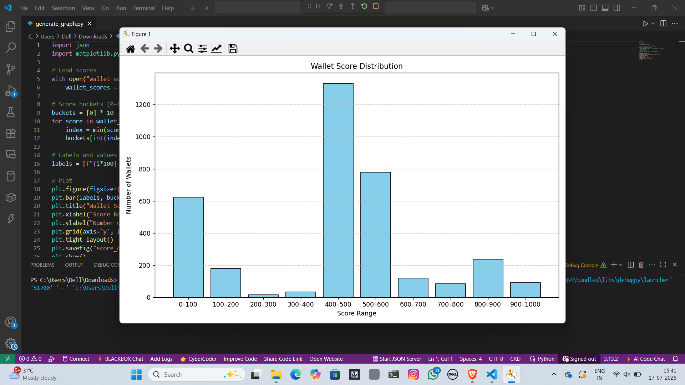

# Wallet Credit Score Analysis

This document provides insights into the credit scores assigned to DeFi wallets based on their transaction behavior on the Aave V2 protocol. The scoring system evaluates actions such as deposits, borrows, repayments, redeems, and liquidations to assess wallet reliability and activity.

##  What Is a Wallet Score?

A **wallet score** refers to a numerical value (ranging from 0 to 1000) assigned to a blockchain wallet based on its historical behavior on the Aave V2 DeFi lending protocol. Each score reflects how responsibly a wallet interacts with DeFi features such as depositing, borrowing, repaying, redeeming, and avoiding liquidation. This score is useful for assessing the financial health and creditworthiness of a wallet, similar to a credit score in traditional finance.

Each score was derived from the wallet’s:

* Total deposits and redemptions
* Borrowing and repayment activity
* Liquidation history
* Number of different assets used
* Frequency of active days

##  Score Distribution

The wallets were scored on a scale of **0 to 1000**. The distribution across ranges is as follows:

| Score Range | Number of Wallets |
| ----------- | ----------------- |
| 0–100       | 4                 |
| 100–200     | 11                |
| 200–300     | 22                |
| 300–400     | 26                |
| 400–500     | 34                |
| 500–600     | 39                |
| 600–700     | 48                |
| 700–800     | 43                |
| 800–900     | 21                |
| 900–1000    | 13                |

Total Wallets Scored: **261**

## Behavior Analysis by Score Range

###  Lower Score Range (0–300)

Wallets in this range typically exhibit:

* High or repeated liquidation activity.
* Few or no repayments.
* Low total deposit volume.
* Intermittent interaction with the protocol.
* Limited asset diversity.

These wallets are risk-prone, often over-leveraged, or demonstrate opportunistic borrowing without consistent collateral maintenance.

###  Mid Score Range (400–700)

Wallets in this range generally:

* Show regular deposits and redemptions.
* Have some borrowing and repayment activity.
* Avoid liquidation events.
* Interact with a moderate number of assets.

These users demonstrate average protocol usage with moderate risk and reliability.

###  High Score Range (800–1000)

High-performing wallets tend to:

* Maintain a healthy ratio of deposits to borrows.
* Repay loans consistently.
* Avoid any liquidation history.
* Frequently redeem underlying assets.
* Participate across multiple assets and show long-term engagement.

These are the most creditworthy users who use the protocol responsibly.

## Conclusion

The scoring system provides a robust method for evaluating DeFi wallet behavior. High scores align with safer, long-term users, while low scores help identify risky participants. This can be useful for risk management, lending decisions, or creating incentive models in decentralized finance systems.
